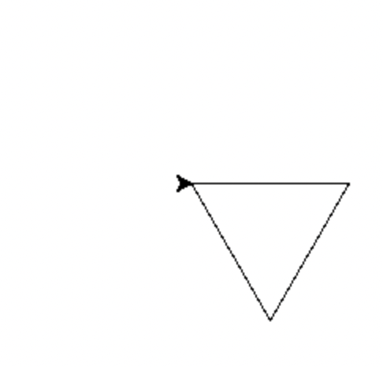
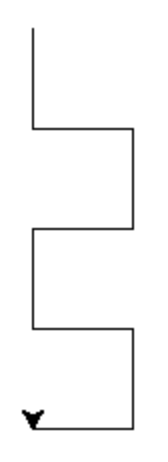

# Projeto 0 - Desenferrujar

Nas primeiras aulas vamos reavivar os nossos conhecimentos fundamentais de programação em Python: cálculo numérico, listas, iteração e processamento de strings.

Aceda aos ficheiros do Projeto 0, onde deve preencher as suas soluções num ficheiro `projeto0.py`:

- Acendendo à Team [prog2bio2324](https://replit.com/team/prog2bio2223) e iniciando o Projeto0.
- Pode consultar os ficheiros individuais na pasta [projeto0](../scripts/projeto0) e fazer download dos mesmos para desenvolver o projeto no seu computador e utilizando um IDE à sua escolha.
- Pode fazer download de todo o projeto como um arquivo zip [aqui](https://minhaskamal.github.io/DownGit/#/home?url=https://github.com/hpacheco/progii/tree/master/scripts/projeto0).

Neste projeto (primeiras duas semanas de aulas práticas) vamos resolver livremente alguns exercícios de programação básica em Python. Sinta-se à vontade para requisitar mais ou novos exercícios aos docentes.

Este projeto é completamente livre e não sujeito a avaliação. Os alunos devem sentir-se à vontade para explorar exercícios de diferentes tipos, resolver exercícios em conjunto, discutir soluções com a turma ou pedir sugestões aos docentes.
Este enunciado contém também uma potencial solução para cada exercício. A ideia é aferirmos os conhecimentos e lacunas de cada um para podermos adaptar o ritmo da cadeira e a matéria seguinte. Tentem resolver os exercícios antes de olhar para as soluções!
O projeto tem também um conjunto de testes para poderem testar a correção das vossas soluções para cada questão.

## 1 - Cálculo numérico

### Exercício 1.1

Escreva uma função ``perim_circ(r)`` que calcule o perímetro de um círculo com raio `r`.
Por exemplo:
```python
> perim_circ(4)
25.132741228718345
```

<details>
<summary>Solução</summary>
    
```python
def perim_circ(r):
    return 2 * math.pi * r
```
</details>

### Exercício 1.2

Escreva uma função `area_circ(r)` que calcule a área de um círculo com raio `r`.
Por exemplo:
```python
> area_circ(4)
50.26548245743669
```

<details>
<summary>Solução</summary>
    
```python
def area_circ(r):
    return math.pi * r**2
```
</details>

### Exercício 1.3

A conversão entre medidas de temperatura em *Fahrenheit* e *Celsius* pode ser efectuada pela fórmula $$C = \frac{5}{9} (F - 32)$$, onde `F` é a temperatura em *Fahrenheit* e `C` em *Celsius*. Escreva uma função `celsius(F)` que efetue a
conversão de *Fahrenheit* para *Celsius* de uma temperatura `F`.
Por exemplo:
```python
> celsius(0)
-17.77777777777778
> celsius(20)
-6.666666666666667
```

<details>
<summary>Solução</summary>

```python
def celsius(F):
    return (5/9) * (F - 32)
```
</details>

### Exercício 1.4

A distância entre dois pontos no plano de coordenadas $(x_1,y_1)$ e $(x_2,y_2)$ é dada por:
$$d = \sqrt{(x_2 - x_1)^2 + (y_2 - y_1)^2}$$
Implemente uma função `dist(`$x_1$`,`$y_1$`,`$x_2$`,`$y_2$`)` que use esta fórmula para calcular a distância.
Por exemplo:
```python
> dist(1,1,4,4)
4.242640687119285
```

<details>
<summary>Solução</summary>

```python
def dist(x1,y1,x2,y2):
    return math.sqrt((x2-x1)**2 + (y2-y1)**2)
```
</details>

### Exercício 1.5

Escreva uma função `radianos(graus,mins,segs)` que, dado o valor de um ângulo em graus,
minutos e segundos, converte-o para radianos. Relembre que $360º$
corresponde a $2 \pi$ radianos, cada grau
tem 60 minutos e cada minuto tem 60 segundos.
Por exemplo:
```python
> radianos(0,0,60)
0.0002908882086657216
> radianos(0,60,0)
0.017453292519943295
> radianos(180,10,40)
3.144695461148894
```

<details>
<summary>Solução</summary>

```python
def radianos(graus,mins,segs):
    mins = mins + segs / 60
    graus = graus + mins / 60
    return graus * (2 * math.pi / 360)
````
</details>

### Exercício 1.6

Escreva uma função `segundos(horas,mins,segs)` que, dada uma duração em horas, minutos e segundos, calcula e retorna essa mesma duração em segundos.
Por exemplo:
```python
> segundos(2,15,30)
8130
```

<details>
<summary>Solução</summary>

```python
def segundos(horas,mins,segs):
    mins = mins + horas * 60
    segs = segs + mins * 60
    return segs
```
</details>

### Exercício 1.7

Normalmente calcula-se juros com base num número inteiro de períodos (o número de anos, por exemplo). No entanto, em algumas situações é útil calcular o juro como uma função contínua do tempo.
A fórmula para calcular o valor de um investimento ao longo do tempo t é apresentada ao lado, onde $P_0$ é o montante inicial investido, $r$ é a taxa de juro e $t$ é o tempo que passou desde o momento em que se fez o investimento.

$P(t) = P_0 e^{rt}$

Escreva uma função `juros(`$P_0,r,t$`)` que calcule $P(P_0)$, ou seja, que retorne o valor de um investimento $P_0$ no instante $t$, a uma taxa de juro $r$.

<details>
<summary>Solução</summary>

```python
def juros(p0,r,t):
    return p0 * math.exp(r * t)
````
</details>

## 2 - Listas e iteração

### Exercício 2.1

Considere um programa que começa com a atribuição de uma lista de valores de temperatura (em Celsius) à variável `tempC`:
```python
tempC = [-5,0,5,10,15,20,25]
```

* Defina uma função `tempC1` contendo um ciclo `for` que imprime cada um dos valores da lista `tempC` numa linha separada.
O resultado deve ser
```python
> tempC1()
-5
0
5
10
15
20
25
```

<details>
<summary>Solução</summary>

```python
def tempC1():
    for temp in tempC:
        print(temp)
```
</details>


* Defina uma função `tempC2` que imprima os mesmos valores, gerando-os com a função `range`.

<details>
<summary>Solução</summary>

```python
def tempC2():
    for temp in range(-5,30,5):
        print(temp)
```
</details>

* Defina uma função `tempC3` que utilize um ciclo `while` para produzir o mesmo resultado da alínea anterior.

<details>
<summary>Solução</summary>

```python
def tempC3():
    temp = -5
    while (temp <= 25):
        print(temp)
        temp += 5
```
</details>

* Defina uma função `tempC4` que utilize um ciclo em que para os valores de temperatura acima, em cada linha imprime o valor em Celsius e o valor correspondente em Fahrenheit.

<details>
<summary>Solução</summary>

```python
def fahrenheit(c):
    return c * (9/5) + 32
def tempC4():
    for temp in tempC:
        print(temp,fahrenheit(temp))
````
</details>

### Exercício 2.2

Considere um programa que começa com a seguinte atribuição:

```python
xs = [12, 10, 32, 3, 66, 17, 42, 99, 20]
```

* Defina uma função `ex22_1` contendo um ciclo `for` que imprime cada um dos números da lista `xs` numa linha separada.
Ou seja:
```python
> ex22_1()
12
10
32
3
66
17
42
99
20
```

<details>
<summary>Solução</summary>

```python
def ex22_1():
    for x in xs:
        print(x)
```
</details>
    
* Defina uma função `ex22_2` contendo um outro ciclo em que, em cada linha, imprime o número, o seu quadrado, e a sua raiz quadrada.

<details>
<summary>Solução</summary>

```python
def ex22_2():
    for x in xs:
        print(x,x**2,math.sqrt(x))
```
</details>
    
* Defina uma função `ex22_3` contendo um ciclo que soma todos os números em xs usando uma variável auxiliar total, e imprime numa linha separada cada um dos números da lista e a soma parcial até esse número.

<details>
<summary>Solução</summary>

```python
def ex22_3():
    total = 0
    for x in xs:
        print(x,total)
        total += x
```
</details>
    
### Exercício 2.3

Usando o módulo `turtle`, escreva uma função `poligono_reg(t,n,lado)`, sem valor de retorno,
que faz uma tartaruga `t` desenhar um polígono regular com `n` lados de comprimento `lado`. Por exemplo,
com `poligono_reg(t,3,100)` a tartaruga `t` desenha um triângulo equilátero com 100 pixels de lado.

**Nota:** a soma dos ângulos externos de um polígono é $360°$.

Para testar, pode utilizar o seguinte programa:
```python
window = turtle.Screen()
alex = turtle.Turtle()
poligono_reg(alex,3,100)
window.mainloop()
```
O resultado esperado será:



<details>
<summary>Solução</summary>

```python
def poligono_reg(t,n,lado):
    deg = 360 / n
    for _ in range(n):
        t.forward(lado)
        t.right(deg)
```
</details>

### Exercício 2.4

Usando o módulo `turtle`, escreva uma função `friso(t, n, lado)`, sem valor de retorno, que desenha um friso em forma de muralha com `n` ameias em que a largura de cada segmento é `lado`. 

Note que a tartaruga deve terminar com a orientação original.

Para testar, pode utilizar o seguinte programa:
```python
window = turtle.Screen()
alex = turtle.Turtle()
friso(alex,2,50)
window.mainloop()
```
O resultado esperado será o desenho da figura seguinte:



<details>
<summary>Solução</summary>

```python
def friso(t,n,lado):
    t.right(90)
    for _ in range(n):
        t.forward(lado)
        t.left(90)
        t.forward(lado)
        t.right(90)
        t.forward(lado)
        t.right(90)
        t.forward(lado)
        t.left(90)
```
</details>

### Exercício 2.5

O preço atual da gasolina é 1.63 euros por litro. Implemente a função `valor(v)` que, dada a lista
`v` de litros abastecidos numa viagem, retorna o valor total despendido.
Por exemplo:
```python
> valor([24.8, 49.1])
120.457
```

<details>
<summary>Solução</summary>

```python
def valor(v):
    total = 0
    for litro in v:
        total += litro * 1.63
    return total
```
</details>

<details>
<summary>Solução 2 - Funcional </summary>

```python
def valor(v):
    return sum(map(lambda litro : litro * 1.63,v))
```
</details>

### Exercício 2.6

Escreva uma função `classifica(p)` que, dada uma pontuação `p` obtida num exame (de 0 a 100) retorna
uma mensagem de classificação de acordo com a tabela seguinte. Utilize essa função para escrever um
programa que imprime o número, nome e classificação segundo essa tabela da lista de alunos que se segue
(cada tuplo contém o número de aluno, o seu nome, e a classificação de 0 a 100).

|   pontuação               |  mensagem      | 
|:-------------------------:|:--------------:|
| $$< 0 \,\vee > 100$$      | "inválido"     |
| $$< 50$$                  | "insuficiente" |
| $$\geq 50 \,\wedge < 70$$ | "suficiente"   |
| $$\geq 70 \,\wedge < 80$$ | "bom"          |
| $$\geq 80 \,\wedge < 90$$ | "muito bom"    |
| $$\geq 90$$               | "excelente"    |

Por exemplo, para a seguinte lista de pontuações:
```python
studs = [("UP194187304", "José Fonseca", 97),\
         ("UP194209183", "Manuel Ferreira", 87),\
         ("UP194294793", "Maria Ramos", 50),\
         ("UP194399128", "Antonio Fernandes", 45),\
         ("UP194739873", "Júlia Pinto", -1),\
         ("UP194739889", "Manuela Faria", 50)]
```
a invocação `classifica(studs)` deve imprimir:
```python
UP194187304 José Fonseca excelente
UP194209183 Manuel Ferreira muito bom
UP194294793 Maria Ramos suficiente
UP194399128 Antonio Fernandes insuficiente
UP194739873 Júlia Pinto inválido
UP194739889 Manuela Faria suficiente
```

<details>
<summary>Solução</summary>

```python
def converte_nota(n):
    if n < 0 or n > 100: return "inválido"
    elif n < 50: return "insuficiente"
    elif n >=50 and n < 70: return "suficiente"
    elif n >= 70 and n < 80: return "bom"
    elif n >= 80 and n < 90: return "muito bom"
    else: return "excelente"
def classifica(p):
    for numero,nome,nota in p:
        print(numero,nome,converte_nota(nota))
```
</details>

### Exercício 2.7

A fórmula de Leibniz para aproximar $\pi$ é:
$$\pi = 4 * (1 - \frac{1}{3} + \frac{1}{5} - \frac{1}{7} + \frac{1}{9} + \dots) = 4 * \sum_{n=0}^{\infty} \frac{(-1)^n}{2 n + 1}$$

Implemente a função `leibniz(k)` que resulta no somatório dos primeiros `k` termos desta série.
Por exemplo: 
```python
> leibniz(4)
2.8952380952380956
```
Adicionalmente, documente a sua função com uma docstring.

<details>
<summary>Solução</summary>

```python
def leibniz(k):
    """Calcula a fórmula de Leibniz para os primeiros k termos"""
    return 4 * sum([ ((-1)**n / (2 * n + 1)) for n in range(k) ])
```
</details>

### Exercício 2.8

Implemente a função `sum_within(x, a, b)` que calcula a soma dos valores da lista `x` que estão
compreendidos entre `a` e `b`.
Por exemplo, o resultado de `sum_within([4, 7, 44, 23], 17, 46)` é `67`.

<details>
<summary>Solução</summary>

```python
def sum_within(x,a,b):
    s = 0
    for n in x:
        if n >= a and n <= b: s+= n
    return s
```
</details>

<details>
<summary>Solução 2 - Compreensão </summary>

```python
def sum_wihin(x,a,b):
    return sum([n  for n in x if n >= a and n <= b ])
sum_wihin([4, 7, 44, 23], 17, 46)
```
</details>

### Exercício 2.9

Escreva a função `maximo2(xs)` que calcula o segundo maior valor numa lista `xs`. Verifique que o procedimento retorna o valor correcto quando o maior valor ocorre mais do que uma vez.

Exemplos:
```python
> maximo2([3, -2, 1, 0, -2, 1])
1
> maximo2([1, 3, 2, 3, 0])
2
```

<details>
<summary>Solução</summary>

```python
def maximo2(xs):
    m1 = float('-inf')
    m2 = float('-inf')
    for x in xs:
        if x > m1: m1=x
        elif x > m2 and x != m1: m2=x
    return m2
```
</details>

<details>
<summary>Solução 2 - Set </summary>

```python
def maximo2(xs):
    non_reps = set(xs)
    non_reps.remove(max(non_reps))
    return max(non_reps)
```
</details>

### Exercício 2.10

Escreva uma função `repetidos(lista)` que testa se há elementos repetidos numa `lista`; o resultado
deve ser um valor lógico. A sua função deve funcionar com listas de elementos de vários tipos (e.g. de números ou
de cadeias de carateres).

Exemplos:
```python
> repetidos(['ola', 'ole', 'abba', 'ole'])
True
> repetidos([3, 2, -5, 0, 1])
False
```

<details>
<summary>Solução</summary>

```python
def repetidos(lista):
    vistos = []
    for x in lista:
        if x in vistos: return True
        else: vistos.append(x)
    return False
```
</details>

<details>
<summary>Solução 2 - Set</summary>

```python
def repetidos_set(lista):
    return len(lista) != len(set(lista))
```
</details>

### Exercício 2.11

Podemos contar algarismos decimais na representação de um número fazendo divisões inteiras por dez. Por exemplo: 9733 tem 4 algarismos porque podemos fazer quatro divisões sucessivas por 10 obtendo os quocientes 973, 97, 9 e 0 (paramos quando chegamos a zero).

Escreva uma função `algarismos(n)` cujo resultado é o número de algarismos decimais de n.
**Sugestão:** use um ciclo `while` para repetir as divisões sucessivas e contar o número de iterações.

Exemplos:
```python
> algarismos(9)
1
> algarismos(1234)
4
```

<details>
<summary>Solução</summary>

```python
def algarismos(n):
    i = 0
    while (n > 0):
        n //= 10
        i+=1
    return i
```
</details>

## 3 - Processamento de strings

### Exercício 3.1

Escreva duas definições da função `conta_letras(txt)` que retorna o número de letras (maiúsculas
ou minúsculas) sem acentos da cadeia de caracteres `txt`; numa das versões compare os carateres de
`txt` com `'a'`, `'A'`, `'z'`, `'Z'` e na outra utilize as funções pré-definidas ``string.letters`` ou ``string.ascii_letters``.

Exemplo:
```python
> conta_letras('Ola, mundo!')
8
```

<details>
<summary>Solução</summary>

```python
def is_letra(c):
    return (c >= 'a' and c <= 'z') or (c >= 'A' and c <= 'Z')
def conta_letras(txt):
    n = 0
    for c in txt:
        if is_letra(c): n+=1
    return n
```
</details>

<details>
<summary>Solução 2 - Compreensão </summary>

```python
def conta_letras(txt):
    return len([ c for c in txt if is_letra(c) ])
```
</details>

<details>
<summary>Solução 3 - Compreensão + string function </summary>

```python
def is_letra2(c):
    return c.lower() in string.ascii_letters
def conta_letras_compreensao2(txt):
    return len([ c for c in txt if is_letra2(c) ])
```
</details>

### Exercício 3.2

Escreva uma definição da função `filtra_letras(txt)` que, dada uma cadeia de caracteres `txt`,
retorna uma cadeia com apenas as suas letras maiúsculas ou minúsculas.

Exemplo:
```python
> filtra_letras('Ola!, -- disse ele...')
'Oladisseele'
````

<details>
<summary>Solução</summary>

```python
def filtra_letras(txt):
    res = ""
    for c in txt:
        if is_letra(c): res+=c
    return res
```
</details>

<details>
<summary>Solução 2 - Compreensão</summary>

```python
def filtra_letras(txt):
    return "".join([c for c in txt if is_letra(c) ])
```
</details>

### Exercício 3.3

Uma cadeia de carateres é um palíndromo se as sequências obtidas lida da esquerda para a direita
e vice-versa são iguais, independentemente das letras serem maiúsculas ou minúsculas. Exemplo:
`"reviveR"` é um palíndromo.
Escreva uma definição da função `palindromo(txt)` que verifica se uma cadeia de caracteres (ignorando capitalização) é um
palindromo; o resultado deve ser True ou False.
Por exemplo:
```python
> palindrono("reviveR")
True
> palindrono("aaaa")
True
> palindrono("ola olo")
False
```

<details>
<summary>Solução</summary>

```python
def palindrono(txt):
    for i in range(len(txt)//2):
        if txt[i].lower() != txt[-i-1].lower(): return False
    return True
```
</details>

### Exercício 3.4

A cifra de Cesar consiste em substituir cada carater alfabético de uma mensagem pelo carater
que está k posições à sua direita, na ordem alfabética. Escreva a função `cesar(k,txt)` que retorna o
valor cifrado de txt usando a *chave* `k`.
Por exemplo:
```python
> cesar(3,"mensagem secreta")
phqvdjhp#vhfuhwd
```

<details>
<summary>Solução</summary>

```python
def cesar(k,txt):
    return "".join([ chr(ord(c)+k) for c in txt ])
```
</details>

### Exercício 3.5

Escreva a função `remove_py_com(txt)` que remove comentários de linhas de código Python, i.e.,
os sinais de cardinal `#` e tudo o que estiver à sua direita. Note que se o cardinal estiver dentro de uma
string não é um comentário (considere apenas as strings delimitadas por aspas `"`).

Exemplos:
```python
> remove_py_com("def f(x): # f function ")
'def f(x): '
> remove_py_com('def "#" f(x) # comentário')
'def "#" f(x) '
```
Sugestão: use ciclos while. **Nota:** não é necessário usar métodos da classe `str`.

<details>
<summary>Solução</summary>
    
```python
def remove_py_com(txt):
    stop = False
    isstring = False
    i = 0
    while (not stop and i < len(txt)):
        if txt[i] == '\"': isstring = not isstring
        elif txt[i] == '#' and not isstring: stop=True
        i+=1
    return txt[:i-1]
```
</details>

### Exercício 3.6

Defina uma função `forte(passwd)` que verifica se uma palavra-passe, dada pela cadeia de caracteres `passwd`, é forte. Considera-se que a palavra-passe é forte se tiver 8 caracteres ou mais, e incluir
pelo menos uma letra maiúscula, uma letra minúscula e um algarismo. O resultado deve ser um valor
lógico (`True` ou `False`).
Exemplos:
```python
> forte('9EwL56')
False
> forte('HXKW1393')
False
> forte('ffu4G7Fghjk')
True
```

<details>
<summary>Solução</summary>

```python
def forte(passwd):
    maiusculas = { c for c in passwd if c.isupper() }
    minusculas = { c for c in passwd if c.islower() }
    algarismos = { c for c in passwd if c.isdigit() }
    return len(passwd) >= 8 and len(maiusculas) > 0 and len(minusculas) > 0 and len(algarismos) > 0
```
</details>

### Exercício 3.7

Uma cadeia é um palíndromo se se lê da mesma forma nos dois sentidos, ignorando os espaços entre letras, sinais de pontuação e/ou a troca de maiúsculas e minúsculas. Assim, os exemplos seguintes são palíndromos:
````python
"Amora me tem aroma."
"Madam, I'm Adam."
"A man, a plan, a canal: Panama"
````
Escreva uma função `palindrono_geral(txt)` para testar se uma cadeia de caracteres txt é um palíndromo neste sentido geral.
**Sugestão:** pode resolver este problema combinando os métodos `lower()` e `isalpha()` de cadeias de carateres.

<details>
<summary>Solução</summary>

```python
def palindrono(txt):
    # só temos que percorrer a string até meio
    for i in range(len(txt)//2):
        # a cada passo compara com o caracter na posição inversa
        if txt[i] != txt[-1-i]: return False
    return True

def palindrono_geral(txt):
    alphas = [ c for c in txt.lower() if c.isalpha() ]
    return palindrono(alphas)
```
</details>

### Exercício 3.8

Escreva uma função `ocorrencias(txt,c)` que retorna uma lista com os índices das ocorrências de um caracter `c` na cadeia `txt`.
Por exemplo:
```python
> ocorrencias('banana','a')
[1, 3, 5]
```

<details>
<summary>Soluções</summary>

```python
def ocorrencias(txt,c):
    cs = []
    for i,t in enumerate(txt):
        if t==c: cs.append(i)
    return cs
```
</details>

### Exercício 3.9

Escreva uma função `contaSequencia(dna,par)` que retorna o número de ocorrências de uma `sequencia` de caracteres numa string de `dna`.
Por exemplo:
```python
> contaSequencia('ACGTTACGGAACG','ACG')
2
```

<details>
<summary>Solução</summary>

```python
def contaSequencia(dna,par):
  c = 0; i = 0
  while (i < len(dna)):
    if dna[i:i+len(par)] == par:
      c = c + 1; i = i + len(par)
    else: i = i + 1
  return c
```
</details>

<details>
<summary>Solução 2 - string find</summary>

```python
def contaSequencia(dna,par):
  c = 0; start = 0
  while (start >= 0):
      pos = dna.find(par,start)
      if pos >= 0: c = c + 1; start = pos+len(par)
      else: start = pos
  return c   
```
</details>

## Mais exercícios

Pode encontrar mais alguns exercícios na pasta [progi](../2023/projetos/progi), que contém as fichas de exercícios da cadeira de Programação I.
