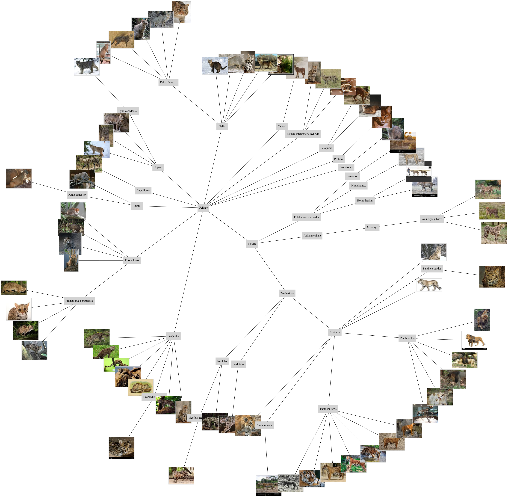

# Projeto 2 - Análise de dados

Neste segundo projeto vamos investigar os conceitos base de análise de dados em Python de uma perspetiva prática, e aplicá-los na leitura e processamento de dados em formatos comumente presentes na web.

Aceda aos ficheiros do Projeto 2, onde deve preencher as suas soluções num ficheiro `projeto2.py`:

- Fazendo login no [replit](https://replit.com/) com a conta Google UP (upXXXXX@g.uporto.pt), acendendo à Team [prog2bio2223](https://replit.com/team/prog2bio2223) e iniciando o Projeto2.
- Pode consultar os ficheiros individuais na pasta [projeto2](../scripts/projeto2) e fazer download dos mesmos para desenvolver o projeto no seu computador e utilizando um IDE à sua escolha.
- Pode fazer download de todo o projeto como um arquivo zip [aqui](https://minhaskamal.github.io/DownGit/#/home?url=https://github.com/hpacheco/progii/tree/master/scripts/projeto2).

## Tarefa 1 (JSON)

Estude o ficheiro [mammals.json](../scripts/projeto2/dados/mammals.json), que possui uma listagem da taxonomia de todos os mamíferos registado na base de dados [ENSEMBL](http://www.ensembl.org/index.html). Este ficheiro foi extraído a partir da API [seguinte](https://rest.ensembl.org/documentation/info/taxonomy_id) que permite consultar individualmente elementos da taxonomia. Também pode explorar a taxonomia no [site do NCBI](https://www.ncbi.nlm.nih.gov/Taxonomy/Browser/wwwtax.cgi).

A intuição é que a taxonomia forma uma árvore: espécies concretas (como humanos) são folhas; nodos intermédios da árvore são sub-categorias na hierarquia de mamíferos. 

Explore este conjunto de dados escrevendo programas Python que respondam às seguintes questões:

* Quantas espécies de mamíferos (folhas da árvore) estão registadas? Complete a definição da função `totalEspecies`, que retorna um número inteiro.
* Qual é o parente mais próximo entre duas espécies? Complete a definição da função `parenteMaisProximo`, que recebe o nome de duas espécies, por exemplo homens (*Homo sapiens*) e macacos japoneses (*Macaca fuscata*), e retorna o nome científico da categoria respetiva.
* Complete a definição da função `desenhaGatos` que representa um diagrama circular da taxonomia da família dos gatos (*Felidae*), como a seguinte imagem:



Para isso, vamos utilizar a ferramenta [Graphviz](https://graphviz.org/) que gera diagramas a partir de ficheiros de texto no formato [DOT](https://graphviz.org/docs/layouts/dot/). Adapte o seguinte template, em que uma categoria `n1` com nome `label1` é a raiz da árvore, e três nodos `n2`, `n3` e `n4` são filhos da raiz.

```
graph G {
  layout=twopi
  ranksep=4;
  ratio=auto;
  
  n1 [root=True,label="label1",shape=plaintext]
  n1 -- { n2 n3 n4 }

}
```

Pode inspecionar o template de exemplo em visualizadores online como [este](https://edotor.net/). A função `desenhaGatos` deve gerar um ficheiro `gatos.dot`. A formatação (cores, tamanhos, formas, imagens, etc) do diagrama fica à escolha dos alunos; para isso, pode consultar a [documentação](https://graphviz.org/documentation/) do Graphviz. O resultado não tem que ser um diagrama igual ao demonstrado em cima, mas para obter nota máxima nesta alínea deve utilizar alguns elementos de formatação diferentes.

## Tarefa 2 (NumPy) (Valorização)

Um dos tipos de análise mais comuns em bioinformática é a utilização de [dotplots](https://omicstutorials.com/interpreting-dot-plot-bioinformatics-with-an-example) para comparar sequências.
Dadas duas sequências, um dotplot consiste numa matriz binária (com valores `0` ou `1`) que cruza todos os valores de ambas as sequências: o mesmo valor na posição `i` da primeira sequência e na posição `j` da segunda sequência determina um `1` na célula `(i,j)`da matriz, ou `0` vice-versa. A intuição é que o dotplot de duas sequências iguais corresponde à matriz de `0`s preenchida com `1` numa das diagonais.

Como uma comparação elemento a elemento de duas sequência tem tipicamente muito ruído, é geralmente comparada uma `sequence window`: para um tamanho de janela `w`, se duas sub-sequências iguais de comprimento `w` forem encontradas, é colocado um `1` nas posição emparelhadas das duas sub-sequências. Para evitar que os matches tenham que ser perfeitos, é muitas vezes usado um `threshold` que define quando duas sequências são consideradas suficientemente iguais (um `threshold` de `0` significa que todas as sequências são iguais, ao passo que um `threshold` de `1` significa que as duas sequências têm que ser iguais). Para esta tarefa, definimos o threshold de duas sub-sequências como a percentagem (vista como um `float` entre `0` em `1`) de elementos iguais ponto-a-ponto.

Complete a definição da função `dotplot`, que recebe um inteiro `window`, um float `threshold` e dos ficheiros no formato FASTA, e desenha a matriz correspondente ao dotplot como um gráfico. Teste a sua função para diferentes valores de `window` e `threshold` com duas sequências de proteínas de Filamin-A em [humanos](https://www.uniprot.org/uniprotkb/P21333/entry) e em [ratos](https://www.uniprot.org/uniprotkb/Q8BTM8/entry) retiradas da base de dados [UNIPROT](https://www.uniprot.org/), e disponíveis localmente nos ficheiros [P21333.fasta](../scripts/projeto2/dados/P21333.fasta) e [Q8BTM8.fasta](../scripts/projeto2/dados/Q8BTM8.fasta).

**Sugestão:** Comece por desenhar um dotplot apenas com `1` nas posições em que os caracteres das duas sequências são iguais, ignorando os parâmetros `window` e `threshold`, e depois generalize a sua solução para considerar esses parâmetros.

## Tarefa 3 (Pandas)

Considere a base de dados de casos COVID registados em animais, atualizada [neste repositório](https://github.com/amel-github/sars-ani), com uma cópia local [aqui](../scripts/projeto2/dados/sars_ani_data.csv).

Explore este conjunto de dados escrevendo programas Python que respondam às seguintes questões:

* Qual o número de casos reportados com cães? Complete a definição da função `casosCaes` que retorna o número de casos. **NOTA:** Deve somar os números de casos da coluna `number_cases` de cada evento.
* Qual o número de eventos reportados para espécies de felídeos (família *Felidae*)? Complete a definição da função `eventosFelideos`, que retorna uma lista de pares `(espécie,número_eventos)` por ordem decrescente de número de eventos. 
* Por cada classe de animal (coluna `living_conditions`), qual o país com mais eventos de contacto com humanos (coluna `source_of_infection` igual a `human`)? Complete a definição da função `maisHumanos`, que retorna um dicionário `{ classe : país }`.
* Considere apenas eventos com animais de quinta (coluna `living_conditions` igual a `farm`). Para países com pelo menos dois eventos publicados, qual a periodicidade média (em número de dias) em que novos casos foram publicados? Complete a definição da função `mediaQuintas`, que retorna um dicionário `{ país : periodicidade }`.

## Tarefa 4 (GeoJSON)

Considere um dataset com informação sobre a rede de Metro do Porto, disponibilizada abertamente [neste link](https://opendata.porto.digital/ne/dataset/horarios-paragens-e-rotas-em-formato-gtfs), e com uma cópia dos ficheiros mais relevantes na pasta [metro](../scripts/projeto2/dados/metro).

De forma a visualizar mais facilmente os dados, vamos gerar um fichero GeoJSON com a representação geográfica de linhas e estações do Metro do Porto.
O formato [GeoJSON](https://geojson.org/) é JSON válido, e segue uma estrutura específica para representar marcadores geográficos e metadados associados. 
Por exemplo, uma estrutura só com um ponto deverá ter o seguinte formato (como o campo `features` é uma lista, suporta múltiplos objetos como pontos, linhas, polígonos, etc).

```python
{
    "type": "FeatureCollection", 
    "features": [
        {
            "geometry": {
                "type": "Point", 
                "coordinates": [
                    float com valor de longitude, 
                    float com valor de latitude
                ]
            }, 
            "type": "Feature", 
            "properties": um dicionário com a meta-informação associada ao ponto geográfico
            }
        }]
}
```

Complete a definição da função `desenhaMetro` que gera um ficheiro `metro.geojson`. Pode facilmente visualizar o ficheiro resultante num mapa interativo e inspecionar a sua meta-informação em <https://geojson.io/>. Passos recomendados:

1. Comece por ler cada ficheiro do dataset para um `DataFrame` diferente e juntar os dados num só `DataFrame`.
2. Desenhe cada estação como um ponto no mapa. Pode colocar propriedades como o nome de cada estação na meta-informação adicional.
3. Desenhe cada linha de metro como um conjunto de segmentos de recta no mapa, assumindo que o caminho entre duas estações é uma recta. Pode inspecionar como criar segmentos de recta no formato GeoJSON em <https://geojson.io/>. Ajuste a cor para ser consistente com a cor do nome da linha de metro respetiva.

## Tarefa 5 (NetworkX) (Valorização)

Considere ainda o dataset do Metro do Porto. Utilizando a biblioteca `NetworkX`, construa grafos a partir do dataset e responda programaticamente às seguintes questões:

* Qual a estação por onde passam mais linhas de metro? Complete a definição da função `hubPorto` que retorna um tuplo com o nome da estação e um set de nomes de linhas.
* Complete a definição da função `temCaminhoDireto` que recebe o nome de duas estações e retorna um booleano que determina se existe caminho entre as duas estações sem trocar de linha.
* Complete a definição da função `caminhoMaisRapido` que estima o caminho mais rápido entre duas estações, em segundos. Para isso, assuma que trocar de linha dura 5 minutos e que o metro se desloca em linha reta entre estações a uma velocidade constante de 30km/h, utilizando a função `geodist` para calcular a distância em km entre duas geolocalizações.


