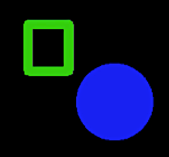

# Projeto 2 - Análise de dados

Neste segundo projeto vamos investigar os conceitos base de análise de dados em Python de uma perspetiva prática, e aplicá-los na leitura e processamento de dados em formatos comumente presentes na web.

Aceda aos ficheiros do Projeto 2, onde deve preencher as suas soluções num ficheiro `projeto2.py`:

- Fazendo login no [replit](https://replit.com/) com a conta Google UP (upXXXXX@g.uporto.pt), acendendo à Team [prog2bio2324](https://replit.com/team/prog2bio2324) e iniciando o Projeto2.
- Pode consultar os ficheiros individuais na pasta [projeto2](../scripts/projeto2) e fazer download dos mesmos para desenvolver o projeto no seu computador e utilizando um IDE à sua escolha.
- Pode fazer download de todo o projeto como um arquivo zip [aqui](https://download-directory.github.io/?url=https%3A%2F%2Fgithub.com%2Fhpacheco%2Fprogii%2Ftree%2Fmaster%2Fscripts%2Fprojeto2).

## Tarefa 1 (JSON)

Estude os ficheiros [prize.json](../scripts/projeto2/dados/prize.json) e [laureate.json](../scripts/projeto2/dados/laureate.json), que possuem uma listagem de todos os prémios Nobel atribuídos e dos seus laureados, disponibilizados [aqui](https://api.nobelprize.org/v1/prize.json) e [aqui](https://api.nobelprize.org/v1/laureate.json).

Explore este conjunto de dados escrevendo funções Python que respondam às seguintes questões:

* Complete a definição da função `maisPartilhados`, que retorna um conjunto de pares de países e categorias com os prémios atribuídos ao maior número de co-laureados.
* Complete a definição da função `multiLaureados`, que retorna um dicionário com as personalidades laureadas em mais do que uma categoria.
* Complete a definição da função `anosSemPremio` que retorna um intervalo fechado com o maior número de anos consecutivos em que pelo menos um dos prémios não foi atribuído.
* Complete a definição da função `rankingDecadas` que retorna, por cada década, o país com mais laureados, considerando o país de afiliação de cada laureado.

## Tarefa 2 (NumPy)

Uma as técnicas de análise de imagens mais comuns em bioinformática é a deteção de contornos de células ou outros organismos. Nesta tarefa, vamos ler imagens para arrays NumPy e explorar a detecção de contornos através de transformações de imagens na forma de arrays NumPy de pixéis, em que cada pixel é uma cor. Note que este exercício é principalmente pedagógico. Várias bibliotecas como o [Pillow](https://pillow.readthedocs.io/en/stable/index.html) foram desenvolvidas precisamente para manipulação de imagens. Nesta tarefa, vamos apenas utilizar o Pillow para ler/escrever imagens, e desenvolver as nossas próprias transformações.

Considere como exemplo duas imagens retiradas do [Cell Image Library](http://www.cellimagelibrary.org/), dos organismos [Micrasterias](http://www.cellimagelibrary.org/images/41737) e [Eudorina](http://www.cellimagelibrary.org/images/39067). Explore o NumPy para definir as seguintes transformações:

* Converta uma imagem a cores (em que uma cor RGB é definida por três componentes do tipo `uint8` entre 0 e 255), numa imagem em tons de cinzento (em que uma cor Grayscale é definida por um componente do tipo `uint8` entre 0 e 255). Existem diferentes formas de converter uma cor RGB numa cor Grayscale. Uma das formas é calcular a luminância da cor, dada pela seguinte fórmula (os humanos são mais sensíveis à cor verde daí esta ter mais peso na média pesada): $Y = 0.21 * R + 0.72 * G + 0.07 * B$. Complete a definição da função `toGrayscale` que recebe um array correspondente a uma imagem a cores e retorna um array correspondente a uma imagem em tons de cinzento.
* Converta uma imagem em tons de cinzento numa imagem a preto e branco (em que cada cor é dada pelo valor 0 para preto ou 255 para branco). Complete a definição da função `toBW` que lê uma imagem em tons de cinzento e escreve numa imagem a preto e branco. Esta função recebe também um *threshold* de cores que serão convertidas em branco, na forma de um intervalo fechado entre 0 e 255. As restantes cores serão convertidas em preto.
* Calcule um *threshold*. Para isso, vamos assumir que uma imagem em toms de cinzento tem uma cor mais preponderante correspondente ao seu fundo, que ficará a branco. Complete a definição da função `autoThreshold`, que recebe uma tolerância $i$ e lê uma imagem em tons de cinzento e returna um *threshold*, ou seja, um intervalo $[c-i..c+i]$ de cinzentos (entre 0 e 255) correspondente ao fundo, centrado na cor mais frequente $c$.
* Converta uma imagem a preto e branco, com fundo branco, numa imagem a preto e branco do seu contorno. Complete a definição da função `toContour` que, para cada pixel da imagem inicial, o coloca a preto na imagem resultante caso algum dos seus pixéis circundantes tiver uma cor diferente, e a branco vice-versa.

Original             |  Grayscale
:-------------------------:|:-------------------------:
  |  

## Tarefa 3 (Pandas)

Considere os dados sobre votações em eleições legislativas em Portugal, recolhidos pelo portal PORDATA [aqui](https://www.pordata.pt/municipios/eleitores+nas+eleicoes+para+a+assembleia+da+republica+total++votantes+e+abstencao-622), com uma versão local no ficheiro [legislativas.xlsx](../scripts/projeto2/dados/legislativas.xlsx).

Explore este conjunto de dados escrevendo programas Python que respondam às seguintes questões:

* Qual o ano de eleições com um maior número de eleitores na Área Metropolitana do Porto? Complete a definição da função `eleitoresPorto`, que retorna o ano em questão.
* Qual a taxa de abstenção no país ao longo dos anos? Complete a definição da função `taxaAbstencao`, que retorna uma lista cronologicamente ordenada `(ano,percentagem)`.
* Por cada município com pelo menos 10000 votantes num dos anos, qual o ano em que mais perderam votantes em relação às eleições anteriores? Complete a definição da função `perdaGrandesMunicipios`, que retorna um dicionário `{ municipio : ano }`.
* Por cada região NUTS III, qual o município que mais perdeu e o que mais ganhou eleitores entre 1975 e 2022? Complete a definição da função `demografiaMunicipios`, que retorna um dicionário `{ regiao : (municipioPerdeu,municipioGanhou) }`.

## Tarefa 4 (NetworkX)

Considere o ficheiro [nominations.csv](../scripts/projeto2/dados/nominations.csv), extraído do [Nobel Prize Nomination Archive](https://www.nobelprize.org/nomination/archive), que contém as nomeações para prémios Nobel entre 1901 e 1970. Estes dados apenas são divulgados após 50 anos. Utilizando a biblioteca `NetworkX`, construa grafos a partir do dataset e responda programaticamente às seguintes questões:

* Qual a pessoa que foi nomeada pelo maior número de entidades para o prémio Nobel? Complete a definição da função `maisNomeado`, que retorna um tuplo com o nome da pessoa e o número de vezes que foi nomeada por entidades diferentes. **Nota:** Se uma entidade nomeou duas vezes a mesma pessoa em anos diferentes, contará apenas uma vez.
* Qual a maior rede de nomeações cruzadas, em que uma pessoa nomeou alguém e foi também nomeada diretamente por essa pessoa, ou nomeada indiretamente por outra(s) pessoa(s) nomeada(s) por quem nomeou, e assim sucessivamente. Complete a definição da função `nomeacoesCruzadas` que retorna um tuplo com o número de pessoas que se nomearam entre si e um conjunto com as categorias envolvidas.
* Albert Einstein ganhou o prémio Nobel da Física em 1921. Richard Feynman recebeu o prémio em 1965. Qual a sequência de nomeações mais direta desde Einstein a Feynman?  Complete a definição da função `caminhoEinsteinFeynman`, que retorna uma lista com os nomes das personalidaades nomeadas por Einstein e que nomearam Feynman por ordem cronológica entre 1921 e 1965.

