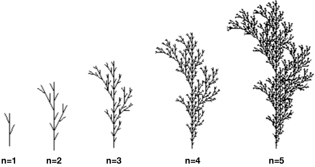
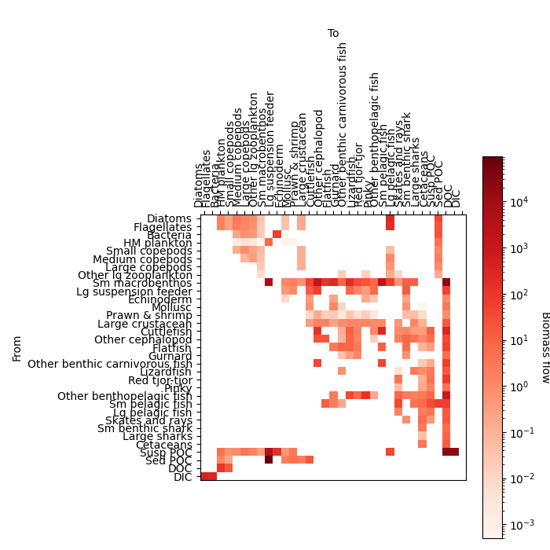

# Projeto 3 - Visualização e animação de dados

Neste terceiro projeto vamos investigar as bibliotecas base de visualização de dados em Python de uma perspetiva prática, e aplicá-las para gerar gráficos e mapas a partir de dados previamente processados.

Aceda aos ficheiros do Projeto 3, onde deve preencher as suas soluções num ficheiro `projeto3.py`:

- Fazendo login no [replit](https://replit.com/) com a conta Google UP (upXXXXX@g.uporto.pt), acendendo à Team [prog2bio2324](https://replit.com/team/prog2bio2324) e iniciando o Projeto3.
- Pode consultar os ficheiros individuais na pasta [projeto3](../scripts/projeto3) e fazer download dos mesmos para desenvolver o projeto no seu computador e utilizando um IDE à sua escolha.
- Pode fazer download de todo o projeto como um arquivo zip [aqui](https://download-directory.github.io/?url=https%3A%2F%2Fgithub.com%2Fhpacheco%2Fprogii%2Ftree%2Fmaster%2Fscripts%2Fprojeto3).
- Se o link anterior não funcionar, pode fazer download de todo o repositório git como um arquivo zip [aqui](https://github.com/hpacheco/progii/archive/refs/heads/master.zip).

## Tarefa 1 (Gráficos)

Fractais são uma classe de formas geométricas que se repetem recursivamente muito explorada em matemática, e com várias aplicações noutras áreas como biologia para explicar o crescimento de células, de plantas ou até a formação de cadeias de DNA.

Vamos explorar uma sub-classe de fractais conhecida como [L-systems](https://en.wikipedia.org/wiki/L-system). Um L-system pode ser definido por uma string inicial, chamada axioma, e um conjunto de regras de re-escrita, que podem ser aplicadas um número $n$ de vezes ao axioma. A linguagem que define um L-system pode ser interpretada como um conjunto de instruções dadas a uma tartaruga (relembre o módulo `turtle`) para desenhar o fractal. Mais detalhes da linguagem [aqui](https://paulbourke.net/fractals/lsys/).
Como exemplo, considere o L-system de uma árvore dado pelo axioma `F` e pelas regra `F` $\rightarrow$ `F[-F]F[+F][F]`. Para um ângulo inicial de $90º$ e rotações de $30º$, o desenho da árvore será o seguinte, para um número $n$ de níveis:

 

1. **Complete** a função `expandeLSystem` que expande um L-system um número $n$ de vezes. Note que esta expansão é independente da linguagem em causa.
2. **Complete** a função `desenhaLSystem` que desenha um L-system utilizando o `matplotlib`. Para isso, deve utilizar a função dada `desenhaTurtle` que recebe uma string e retorna uma lista de segmentos de reta (sendo cada segmento de reta uma lista de pontos) correspondente desenho do fractal.

Para obter nota máxima nesta tarefa, o gráfico deve conter alguns extras em termos de formatação, ao critério dos alunos. Como sugestões, podem por exemplo:
* Desenhar simultaneamente os vários passos de crescimento do fractal com uma cor diferente.
* Desenhar linhas ou controlar eixos para indicar o crescimento do fractal a cada nível.
* Acrescentar informação explicativa numa legenda.

## Tarefa 2 (Gráficos Dinâmicos) 

Considere o dataset de reciclagem nos vários países da União Europeia, publicado em kg/habitante separadamente por resíduos de [packaging](https://ec.europa.eu/eurostat/databrowser/view/env_waspac/default/table) ou [municipal](https://ec.europa.eu/eurostat/databrowser/view/ENV_WASMUN/default/table) e disponível localmente nos ficheiros [env_waspac.tsv](../scripts/projeto3/dados/env_waspac.tsv) e [env_wasmun.tsv](../scripts/projeto3/dados/env_wasmun.tsv), respetivamente.

1. **Complete** a definição da função `desenhaReciclagemPaisIndice` que recebe um objeto `Axes` matplotlib e o nome de um país, e desenha um gráfico nesse `Axes` com a evolução anual do índice (packaging, municipal ou total combinado) de reciclagem desse país (um país da UE ou a totalidade dos 27). Lide como entender com dados em falta.
2. **Complete** a definição da função `desenhaReciclagem` que cria um gráfico dinâmico de reciclagem na UE. Utilize botões interativos matplotlib para selecionar quer o país, quer o tipo de reciclagem. Deve desenhar dinamicamente um gráfico para a seleção escolhida.

Para obter nota máxima nesta tarefa, o gráfico deve conter alguns extras como, por exemplo:

* Desenhar cada série num formato diferente, utilizando por exemplo diferentes curvas/barras/áreas, cores, marcadores, etc.
* Conter uma legenda e/ou labels explicativas das séries e dos eixos em questão.

## Tarefa 3 (Mapas)

Esta tarefa é inspirada [neste](https://insideairbnb.com/porto/) visualizador de dados do Airbnb, em particular para a área urbana do Porto.
Observe os seguintes ficheiros:

* [listings.csv](../scripts/projeto3/dados/listings.csv), que contém uma listagem dos alojamentos registados e um sumário da sua descrição;
* [neighbourhoods.geojson](../scripts/projeto3/dados/neighbourhoods.geojson), que contém a delimitação geográfica das várias zonas que constituem a área urbana do Porto.

Utilizando o `matplotlib` e o `contextily`, desenhe mapas para as seguintes funções:

1. **Complete** a definição da função `desenhaZonas` que desenha no mapa as várias zonas (coluna `neighbourhood`), com cor proporcional ao número total de reviews (coluna `number_of_reviews`) por zona. **Sugestão:** Junte primeiro os dados dos dois ficheiros num só `GeoDataFrame`. 
2. **Complete** a definição da função `desenhaAlojamentos`, que desenha no mapa dos alojamentos disponíveis na cidade do Porto (coluna `neighbourhood_group` igual a `PORTO`). Cada alojamento deve ter um formato de acordo com o seu tipo (coluna `room_type`), tamanho proporcional à disponibilidade (coluna `availability_365`) e cor proporcional ao preço (coluna `price`).
3. **Complete** a definição da função `desenhaTop` que desenha no mapa a localização e o nome do alojamento mais central do anfitrião com mais alojamentos registados. Para isso deve considerar que o centro do Porto tem coordenadas GPS de longitude $-8.6308$ e latitude $41.1647$. **Nota:** Pode usar o método [distance](https://geopandas.org/en/stable/docs/reference/api/geopandas.GeoSeries.distance.html) para calcular a distância de um `GeoDataFrame` a um ponto.

## Tarefa 4 (Grafos)

Esta tarefa pretende visualizar um tipo de relações comuns para analisar a biodiversidade de ecosistemas, conhecidas como [*food webs*](https://en.wikipedia.org/wiki/Food_web), ou *trophic networks*. Considere o ficheiro [bay.csv](../scripts/projeto3/dados/bay.csv), que modela uma matriz de transferência de biomassa entre diversas espécies/organismos num ecosistema marítimo. A intuição é que a matriz modela uma cadeia alimentar, em que haverá maior transferência de biomassa de presas para predadores. Uma forma clássica de visualizar a matriz é convertê-la num mapa de cores, como em baixo:

 

Utilizando o `networkx`, desenhe um mapa circular de acordo com os seguintes passos:

0. Inspecione o `DataFrame` `bay` que reproduz a informação sobre o ecosistema. Cada linha corresponde a uma espécie/organismo, em que cada coluna define a quantidade de biomassa transferida para uma outra espécie/organismo. Cada linha contém também uma última coluna com o [*trophic level*](https://en.wikipedia.org/wiki/Trophic_level), ou seja, a posição que essa espécie ocupa na cadeia alimentar.
1. Complete a definição da função `constroiEcosistema` que retorna um grafo direcionado correspondente. Cada espécie/organismo deve ser um nodo, com um atributo `level` que inclui o seu *trophic level*, e cada transferência de biomassa (não nula) deve dar lugar a uma aresta direcionada, com um atributo `transfer` que inclui a quantidade de biomassa transferida.
2. **Complete** a definição da função `desenhaEcosistema`, que desenha o grafo construído pela função anterior. Configure a formatação a seu gosto, respeitando a seguintes indicações:

    * O layout deve refletir o *trophic level* de cada nodo.
    * O desenho de cada nodo deve incluir alguma referência ao seu nome.
    * O desenho de cada aresta (cor, espessura, etc) deve refletir a quantidade de biomassa transferida.
    * Note que o colormap desenhado em cima assume uma escala logarítmica, porque as diferenças entre os vários nívels de transferência de biomassa são bastante grandes e uma escala linear torna difícil diferenciar os valores intermédios dos valores extremos. Deve ter isso em consideração na sua visualização.

