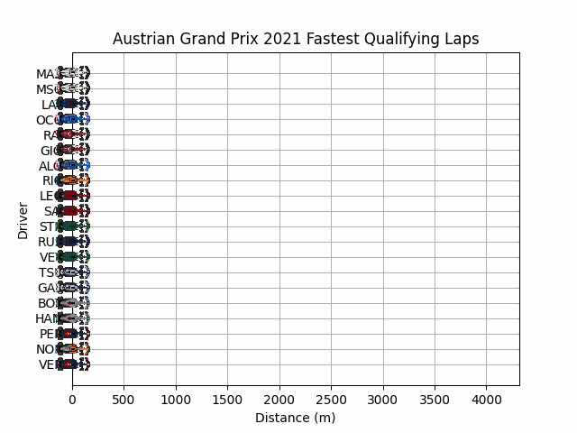

# Projeto 4 - Recurso / Melhoria

A próximas tarefas são destinadas a alunos que desejem fazer recurso ou melhora à cadeira. Para estas tarefas vamos utilizar como contexto o campeonato mundial de Formula 1, ou simplesmente F1.

Uma das principais características da F1 é a grande quantidade de dados dos carros em tempo real e a sua análise para maximizar performance. A biblioteca [FastF1](https://theoehrly.github.io/Fast-F1/) fornece uma grande quantidade de dados recolhidos ao longo de cada corrida. 

Aceda ao repositório [replit](https://replit.com/@up652136/Prog2-Proj4) do Projeto 4, onde pode encontrar um ficheiro `projeto4.py`:

- Criando uma conta no [replit](https://replit.com/) e fazendo `Fork` do projeto, pode resolver o projeto online utilizando o IDE web. 
- Pode consultar os ficheiros individuais na pasta [projeto4](../scripts/projeto4) e fazer download dos mesmos para desenvolver o projeto no seu computador e utilizando um IDE à sua escolha.
- Pode fazer download de todo o projeto como um arquivo zip [aqui](../scripts/projeto4.zip).

## Tarefa 1 (Qualificação intra-equipa)

No campeonato de F1, cada evento tem uma fase de qualificação e uma corrida.
Uma das estatísticas mais recorrentes na F1 são os duelos de qualificação entre os dois pilotos de cada equipa. 
Para cada evento, um piloto ganha o duelo se ficar melhor colocado na qualificação: atingindo uma fase de qualificação mais avançada e/ou fazendo um menor tempo. [^1]

[^1]: Existem 3 fases de qualificação (começando na Q1 e acabando na Q3). Na Q1 e Q2 os pilotos com os 5 piores tempos são eliminados; a Q3 determina a seriação dos 10 melhores pilotos.

No ficheiro `projeto4.py` pode encontrar duas funções pré-definidas que recolhem informações relevantes:
* `getSchedule` retorna uma sequência com todos os eventos num campeonato, identificado pelo ano;
* `getQualifyingLapTimes` retorna informação sobre a qualificação de um dado evento organizado por equipas (10), pilotos (2 por equipa, os indivíduos podem excepcionalmente variar) e fases de qualificação (3), organizada como um dicionário de dicionários com a seguinte forma:

```python
{team1:
    {driver1:
        {'Q1': Timedelta(...), 'Q2': Timedelta(...)}
    ,driver2:
        {'Q1': Timedelta(...), 'Q2': Timedelta(...), 'Q3': Timedelta(...)
    }
...
}
```

**Complete** a função `teamDuels`, que retorna os duelos por equipa durante um campeonato. O resultado deve ser um dicionário de dicionários com a seguinte forma:

```python
{team1: {driver1: 15, driver2: 7}, ... } 
```

**Nota:** Pode ser útil definir uma função auxiliar que calcula o resultado de um duelo para um evento, e combinar essa função para calcular o resultado agregado dos duelos para todos os eventos do campeonato.

## Tarefa 2 (Melhores voltas de qualificação)

Outra informação que podemos obter é a telemetria (posição, velocidade, distância percorrida, etc) de cada carro em tempo real ao longo do seu percurso.
A função `getQualifyingFastestLaps` retorna informação de telemetria (um `DataFrame` ordenado por tempo) da melhor volta de qualificação de cada piloto, com o seguinte formato:

```python
{ driver1 : {'TeamName': team1, 'TeamAbbreviation': abr1, 'TeamColor': color1, 'Telemetry': DataFrame(...), ... }
```

O objetivo desta tarefa é construir uma animação das melhores voltas de qualificação para um dado evento. Para isso, para cada instante de tempo, iremos gerar um gráfico de barras horizontais em `matplotlib` que contém distância percorrida no eixo dos X, e cada barra no eixo dos Y representa um piloto. Para aprimorar a animação, a barra de cada piloto deve ter a cor da sua equipa, e uma imagem do carro da sua equipa para reforçar a intuição que a barra corresponde ao caminho que o carro percorreu.
Utilizando uma funcionalidade de animação do `matplotlib`, podemos gerar uma animação como uma sequência de frames, em que cada frame corresponde a um instante de tempo em segundos, essencial desenhando um novo gráfico a cada frame.

A título de exemplo, [este replit](https://replit.com/@up652136/Prog2-Proj4-TestAnimation) fornece uma animação minimalista de barras horizontais que pode e deve adaptar para resolver esta tarefa.

**Complete** a função `drawFastestLaps` que constrói a animação como um gif animado. Por exemplo, para a invocação `drawFastestLaps(2021,'Austrian Grand Prix')`, o resultado final deve ser uma animação similar à seguinte:

 


